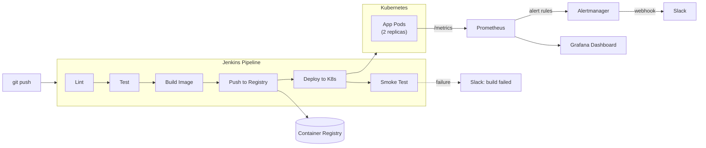

# CI/CD Pipeline with Full Observability Stack

A small instrumented microservice, built and deployed through a Jenkins
pipeline to Kubernetes, monitored end-to-end with Prometheus and Grafana —
covering the full loop from code commit to a dashboard showing whether
that commit is actually healthy in production.

Built as a portfolio project to demonstrate the toolchain end-to-end
(Jenkins, Docker, Kubernetes, Prometheus, Grafana) as one connected
pipeline rather than five disconnected demos, since that's the actual job:
knowing how these tools hand off to each other, not just knowing each one
in isolation.

## Why this exists

Most CI/CD portfolio projects stop at "pipeline deploys to Kubernetes."
That's necessary but incomplete — a deploy that isn't observed isn't
actually operable. This project treats monitoring as a first-class part
of the pipeline, not an afterthought bolted on separately: the app is
instrumented from the first commit, the alert rules are tuned to what
this specific app can actually trigger (not copy-pasted generic rules),
and there's a load-test script specifically so the dashboards and alerts
have something real to react to during a demo.

## Architecture



**The loop this closes:** a commit triggers Jenkins → tests run → image
builds and ships → K8s rolls it out → the running pods expose `/metrics`
→ Prometheus scrapes them → Grafana visualizes it → alert rules watch for
regressions and page Slack if the new version is actually worse, not just
"successfully deployed."

## What's in each folder

| Folder | Contents |
|---|---|
| `app/` | The sample FastAPI service — hand-instrumented with Prometheus counters/histograms, plus its test suite |
| `ci/Jenkinsfile` | Declarative pipeline: lint → test → build → push → deploy → smoke test, with Slack notification on failure |
| `k8s/` | Deployment, Service, Namespace, and an optional ServiceMonitor for Prometheus-Operator clusters |
| `monitoring/prometheus/` | Scrape config (both docker-compose and in-cluster targets) and alert rules tuned to this app's actual failure modes |
| `monitoring/grafana/` | Auto-provisioned datasource + dashboard — zero manual clicking to get a working dashboard |
| `scripts/load_test.sh` | Generates realistic mixed traffic so dashboards/alerts have something to show during a demo |

## Quickstart — local demo (docker-compose, ~2 minutes)

The fastest path to something screen-recordable. No Jenkins or Kubernetes
cluster required for this path.

```bash
./demo.sh
```

This runs the test suite, brings up app + Prometheus + Grafana with
`docker compose`, and starts a load test. Then open:
- **Grafana** — http://localhost:3000 (admin/admin) — the dashboard is
  already there, no setup needed
- **Prometheus** — http://localhost:9090 — check **Status → Rules** to
  see the alert rules loaded and evaluating

## Full path — Jenkins + Kubernetes

1. **Kubernetes**: any cluster works (minikube/kind for local, or a real
   one). Apply the base manifests:
   ```bash
   kubectl apply -f k8s/namespace.yaml
   kubectl apply -f k8s/deployment.yaml
   ```
2. **Jenkins**: run Jenkins itself in Docker or K8s with docker and
   kubectl available to its agent. Set up these credentials in Jenkins
   (**Manage Jenkins → Credentials**):
   - `docker-registry-url` — your registry (e.g. Docker Hub username)
   - `slack-webhook-url` — optional, pipeline degrades gracefully without it
3. Create a Pipeline job pointing at this repo's `ci/Jenkinsfile`, and
   trigger a build. It lints, tests, builds the image, pushes it, deploys
   to the `observability-demo` namespace, and smoke-tests the rollout.
4. **Prometheus**: if you're on a cluster with the Prometheus Operator
   (kube-prometheus-stack), apply `k8s/servicemonitor.yaml`. Otherwise,
   run Prometheus with `monitoring/prometheus/prometheus.yml` — the
   `kubernetes-pods` scrape job auto-discovers any pod carrying the
   `prometheus.io/scrape: "true"` annotation already set in
   `k8s/deployment.yaml`, so no per-pod config is needed as replicas scale.

## Design decisions worth knowing for an interview

- **Hand-instrumented metrics, not auto-instrumentation middleware.**
  `app/main.py` explicitly defines and increments its Counters/Histograms
  rather than using a generic instrumentation wrapper — makes it
  possible to explain exactly what each metric means and why, rather than
  "the library added metrics for me."
- **Alert rules tuned to this app, not copy-pasted.** `HighErrorRate` and
  `HighLatencyP95` reference this app's actual metric names and are set
  at thresholds this app's own `/error` and `/work` endpoints can
  realistically trigger — proven by `scripts/load_test.sh` actually
  tripping them, not just assumed to work.
- **Annotation-based scrape discovery over static targets.** The
  Prometheus config discovers pods via the `prometheus.io/scrape`
  annotation rather than a hardcoded pod list — it keeps working
  correctly as the Deployment scales without a config change, and it's
  the same pattern used in real clusters running plain Prometheus instead
  of the Operator.
- **Deploy and rollback are both explicit pipeline stages**, not manual
  steps — `kubectl rollout status` in the Deploy stage means a bad
  rollout fails the build loudly, and the Smoke Test stage is a second,
  independent check that the newly-deployed pods actually answer
  requests, not just that `kubectl apply` succeeded.
- **Fixed a real mount-path collision while building this**: the first
  draft of `docker-compose.yml` mounted the dashboard JSON files directly
  into Grafana's provisioning folder, which silently shadowed the
  provisioning config that tells Grafana where to load dashboards from.
  Fixed by separating the provisioning-config path from the
  dashboard-content path — worth mentioning if asked about debugging
  Grafana provisioning issues.

## Connecting this to the Self-Healing Incident Response Bot

This project and the [self-healing K8s bot](../self-healing-k8s-bot) are
designed to sit on the same cluster: Prometheus alerts here (`ServiceDown`,
`HighErrorRate`) describe *symptoms*, while the bot's `rules.yaml`
describes *remediations* for specific root causes
(`CrashLoopBackOff`, `OOMKilled`). In a real environment the natural next
step is wiring Alertmanager's webhook receiver to trigger the bot's
detection cycle directly instead of the bot polling on its own interval —
noted here as the integration point, not built out in this repo to keep
each project's scope demoable on its own.

## Known limitations (and what I'd do next)

- `ci/Jenkinsfile` assumes a Jenkins agent already has `docker` and
  `kubectl` available — production setups typically run Jenkins agents
  as ephemeral K8s pods with those tools baked into the agent image; not
  built out here to keep the pipeline file readable as a portfolio piece.
- No Alertmanager routing config is included (`prometheus.yml` points at
  one, but it's not part of this repo's compose stack) — alert *rules*
  are the focus here; Alertmanager's routing/grouping/silencing config is
  a reasonable next addition.
- The app's `/error` failure rate is env-var controlled rather than
  driven by real dependency failures — good enough to demo alerting
  behavior convincingly, but a more advanced version could inject actual
  latency into a downstream call to make the failure mode more realistic.

## Running the tests

```bash
cd app && pip install -r requirements.txt && pytest tests/ -v
```

5 tests covering the health endpoint, the instrumented `/work` and
`/error` endpoints, and confirming the `/metrics` endpoint actually
exposes Prometheus-format output — this is what Jenkins runs in the
pipeline's Unit Tests stage.
